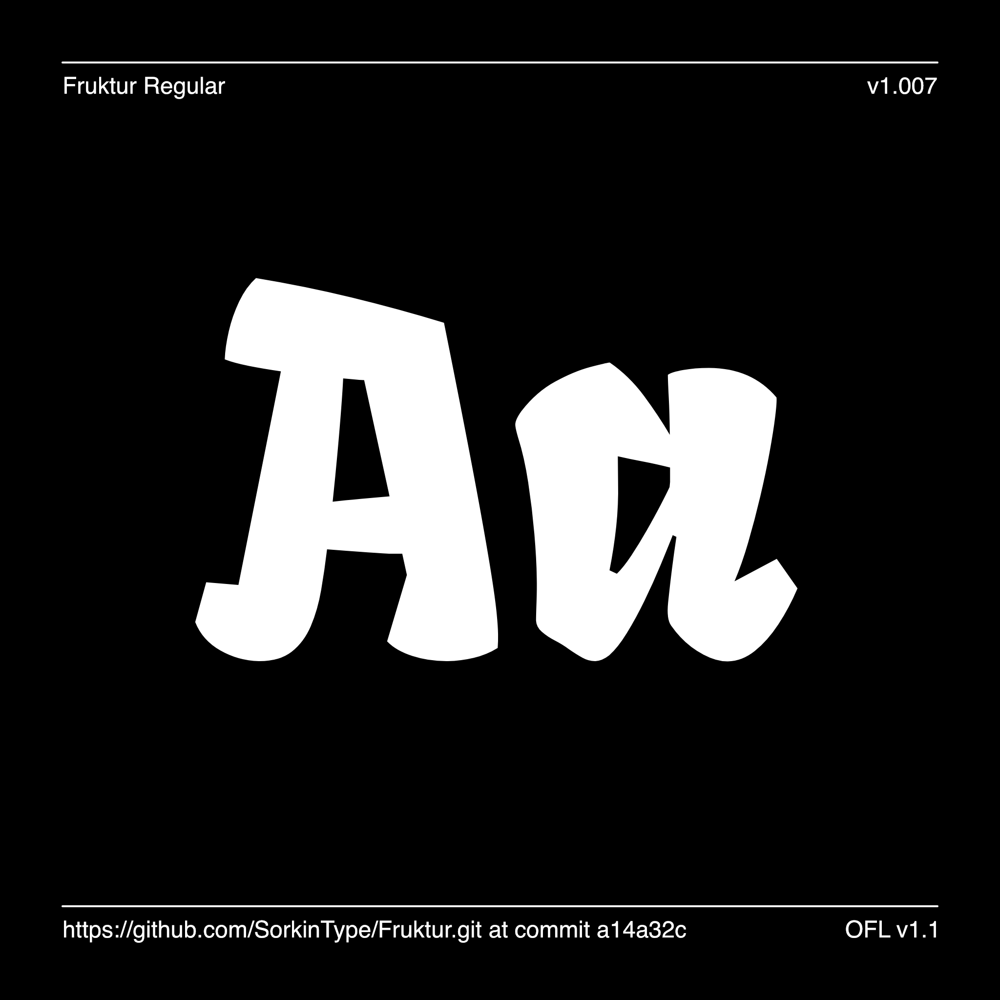

# Fruktur

[![][Fontbakery]](https://SorkinType.github.io/Fruktur/fontbakery/fontbakery-report.html)
[![][Universal]](https://SorkinType.github.io/Fruktur/fontbakery/fontbakery-report.html)
[![][GF Profile]](https://SorkinType.github.io/Fruktur/fontbakery/fontbakery-report.html)
[![][Outline Correctness]](https://SorkinType.github.io/Fruktur/fontbakery/fontbakery-report.html)
[![][Shaping]](https://SorkinType.github.io/Fruktur/fontbakery/fontbakery-report.html)

[Fontbakery]: https://img.shields.io/endpoint?url=https%3A%2F%2Fraw.githubusercontent.com%2FSorkinType%2FFruktur%2Fgh-pages%2Fbadges%2Foverall.json
[GF Profile]: https://img.shields.io/endpoint?url=https%3A%2F%2Fraw.githubusercontent.com%2FSorkinType%2FFruktur%2Fgh-pages%2Fbadges%2FGoogleFonts.json
[Outline Correctness]: https://img.shields.io/endpoint?url=https%3A%2F%2Fraw.githubusercontent.com%2FSorkinType%2FFruktur%2Fgh-pages%2Fbadges%2FOutlineCorrectnessChecks.json
[Shaping]: https://img.shields.io/endpoint?url=https%3A%2F%2Fraw.githubusercontent.com%2FSorkinType%2FFruktur%2Fgh-pages%2Fbadges%2FShapingChecks.json
[Universal]: https://img.shields.io/endpoint?url=https%3A%2F%2Fraw.githubusercontent.com%2FSorkinType%2FFruktur%2Fgh-pages%2Fbadges%2FUniversal.json

Fruktur is a lively serif design inspired by structures found in italic and blackletter shapes. Fruktur is unrepentantly perky and cheerful. Although superfcially a display design, it also works in text far better than you might imagine.

## About

Viktoriya Grabowska is a type designer.

Eben Sorkin designs and art directs typefaces. He works with Sorkin Type Co. and Darden Studio.

## Languages

According to Hyperglot made by Rosetta Type, Fruktur has base support for 395 of the 459 languages of Latin script. These include:

Arbëreshë Albanian, Eastern Abnaki, Afar, Arvanitika Albanian, Western Abnaki, Abron, Achinese, Achuar-Shiwiar, Acheron, Adangme, Eastern Arrernte, Afrikaans, Aguaruna, Gheg Albanian, Tosk Albanian, Amahuaca, Yanesha', Amis, Amarakaeri, Uab Meto, Apinayé, Aragonese, Arabela, Mapudungun, Karo, Asu (Tanzania), Asturian, Waorani, Anuta, Awetí, Southern Aymara, Central Aymara, South Azerbaijani, North Azerbaijani, Bambara, Balinese, Baatonum, Batak Toba, Baoulé, Bemba (Zambia), Bena (Tanzania), Bari, Bikol, Bini, Bislama, Bora, Bosnian, Boko (Benin), Breton, Batak Dairi, Batak Mandailing, Batak Simalungun, Batak Karo, Garifuna, Kaqchikel, Catalan, Chachi, Chavacano, Cashibo-Cacataibo, Cashinahua, Chayahuita, Candoshi-Shapra, Cebuano, Czech, Falam Chin, Chiga, Chamorro, Ojitlán Chinantec, Chuukese, Cimbrian, Chokwe, Central Kurdish, Hakha Chin, Asháninka, Montenegrin, Cofán, Cornish, Corsican, Caquinte, Pichis Ashéninka, Crimean Tatar, Seselwa Creole French, Chiltepec Chinantec, Kashubian, Tedim Chin, Welsh, Danish, Taita, Dendi (Benin), German, Southern Dagaare, Andaandi, Dongolawi, Dehu, Dimli, Zarma, Lower Sorbian, Jola-Fonyi, Dyula, Embu, Standard Estonian, Eastern Maninkakan, English, Ese Ejja, Basque, Ewondo, Faroese, Fanti, Nobiin, Fijian, Filipino, Finnish, Kven Finnish, Fon, French, Western Frisian, Friulian, Ga, Gagauz, Borana-Arsi-Guji Oromo, West Central Oromo, Guadeloupean Creole French, Gilbertese, Gonja, Scottish Gaelic, Irish, Galician, Manx, Gooniyandi, Ga’anda, Swiss German, Wayuu, Paraguayan Guaraní, Yanomamö, Gusii, Gwichʼin, Hän, Eastern Oromo, Haitian, Hawaiian, Northern Qiandong Miao, Hiligaynon, Southern Qiandong Miao, Hani, Caribbean Hindustani, Hopi, Croatian, Upper Sorbian, Hungarian, Huastec, Murui Huitoto, Ibibio, Igbo, Iloko, Indonesian, Icelandic, Italian, Jamaican Creole English, Javanese, Ngomba, Shuar, Japanese, Kara-Kalpak, Kalaallisut, Kamba (Kenya), Makonde, Kabuverdianu, Kekchí, Kaingang, Khasi, Koyra Chiini Songhay, Kikuyu, Kinyarwanda, Kirmanjki, Kalenjin, Kimbundu, Northern Kurdish, Kongo, Konzo, Kaonde, Northern Kissi, Krio, Karelian, Shambala, Kölsch, Kituba (DRC), Kuanyama, Awa-Cuaiquer, Ladino, Langi, Latin, West-Central Limba, Ligurian, Lingala, Lithuanian, Lakota, Ladin, Lombard, Otuho, Lozi, Latgalian, Luxembourgish, Luba-Lulua, Luba-Katanga, Ganda, Luo (Kenya and Tanzania), Mizo, Standard Latvian, Madurese, Marshallese, Mam, Masai, Sharanahua, Matsés, Mende (Sierra Leone), Meru, Mauritian Creole, Makhuwa-Meetto, Meta’, Mi'kmaq, Minangkabau, Mískito, Malagasy, Maltese, Montagnais, Mohawk, Maori, Totontepec Mixe, Creek, Murrinh-Patha, Mirandese, Kala Lagaw Ya, Metlatónoc Mixtec, Ixcatlán Mazatec, Naga Pidgin, Neapolitan, Navajo, Nyemba, South Ndebele, North Ndebele, Ndonga, Low German, Central Nahuatl, Niuean, Ao Naga, Dutch, Ngiemboon, Norwegian, Nomatsiguenga, Pedi, Nyanja, Nyamwezi, Nyankole, Nzima, Occitan, Orma, Oroqen, Mezquital Otomi, Pampanga, Papiamento, Palauan, Páez, Picard, Pijin, Pintupi-Luritja, Paluan, Piemontese, Polish, Pohnpeian, Portuguese, Potawatomi, Upper Guinea Crioulo, Pipil, Ashéninka Perené, K'iche', Quechua, Cook Islands Māori, Balkan Romani, Vlax Romani, Romansh, Romanian, Rotokas, Rundi, Istro Romanian, Macedo-Romanian, Rwa, Sango, Samburu, Sangu (Tanzania), Sicilian, Sena, Seri, Koyraboro Senni Songhai, Secoya, Shilluk, Shipibo-Conibo, Pite Sami, Ume Sami, Shawnee, Slovak, Slovenian, Southern Sami, Northern Sami, Lule Sami, Inari Sami, Samoan, Shona, Soninke, Siona, Somali, Southern Sotho, Miyobe, Spanish, Sardinian, Saramaccan, Sranan Tongo, Swati, Sundanese, Susu, Maore Comorian, Congo Swahili, Swedish, Swahili, Silesian, Tahitian, Atayal, Ditammari, Tetun Dili, Timne, Teso, Tetum, Tagalog, Tiv, Tokelau, Tsakhur, Talysh, Toba, Tonga (Zambia), Tojolabal, Tonga (Tonga Islands), Papantla Totonac, Tok Pisin, Tswana, Tsonga, Purepecha, Muslim Tat, Turkmen, Tumbuka, Turkish, Tuvalu, Twi, Tasawaq, Tzeltal, Tzotzil, Meriam Mir, Umbundu, Munsee, Urarina, Northern Uzbek, Venetian, Venda, Veps, Vietnamese, Makhuwa, Võro, Walser, Waray (Philippines), Warlpiri, Wik-Mungkan, Ho-Chunk, Walloon, Mwani, Wolof, Wiradjuri, Wasa, Waama, Wangaaybuwan-Ngiyambaa, Xavánte, Xhosa, Kenzi, Mattokki, Soga, Yagua, Yao, Yapese, Yangben, Yindjibarndi, Makwe, Yoruba, Yucateco, Zapotec, Ngazidja Comorian, Malaysian, Záparo, Standard Malay, Zulu, Zuni

## Building

Fonts are built automatically by GitHub Actions - take a look in the "Actions" tab for the latest build.

If you want to build fonts manually on your own computer:

* `make build` will produce font files.
* `make test` will run [FontBakery](https://github.com/googlefonts/fontbakery)'s quality assurance tests.
* `make proof` will generate HTML proof files.

The proof files and QA tests are also available automatically via GitHub Actions - look at https://SorkinType.github.io/Fruktur.

## Changelog

**28 May 2022. Version 1.007**
- SIGNIFICANT Language support and symbols support improved.
- SIGNIFICANT kerning added.

## License

This Font Software is licensed under the SIL Open Font License, Version 1.1.
This license is available with a FAQ at
https://scripts.sil.org/OFL

## Repository Layout

This font repository structure is inspired by [Unified Font Repository v0.3](https://github.com/unified-font-repository/Unified-Font-Repository), modified for the Google Fonts workflow.
